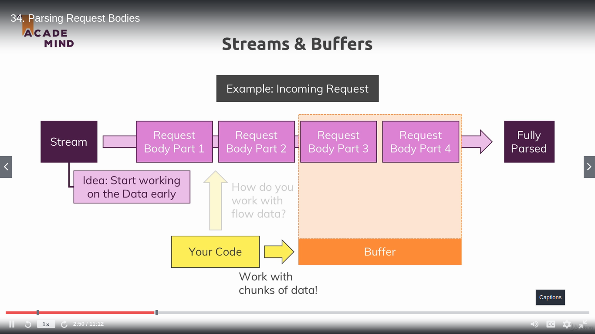

---
Parsing request bodies
Streams and Buffers
Incoming data is send as stream of data

To handle and manipulate streaming data like a video, a large file, etc., we need streams in Node. 
streams work on a concept called buffer.

A buffer is a temporary memory that a stream takes to hold some data until it is consumed.

||||||||||||||||||||||||||||||||||||||||||||||||||||||
The on method binds an event to a object.

It is a way to express your intent if there is something happening, then execute the function added as a parameter. This style of programming is called Event-driven programming.
---